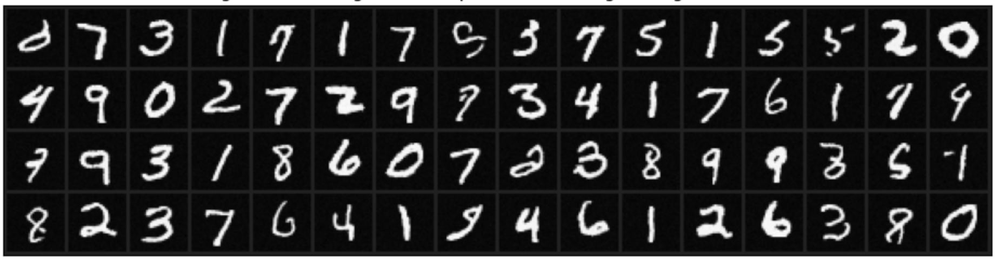

# A simple diffusion model in PyTorch
Here is an unconditional diffusion model from scratch using PyTorch. For building my own intuition, I wanted to see a simple working example without too many nested variables or too much abstraction. This model isn't state of the art and isn't an exact implementation of any existing diffusion model, but it could be useful for building intuition.

It follows the the general framework set out by this insightful but technical NVIDIA paper [Elucidating the Design Space of Diffusion-Based Generative Models](https://arxiv.org/abs/2206.00364). Specifically there is no coupling between training and generation noise distributions. To demonstrate the simplicity, here is the generation code:
```python
@torch.no_grad()
def generate_samples(model, sigma=100.0, sigma_min=0.03, alpha=0.1, beta=.40, device='cuda'):
    x = sigma * torch.randn((64,1,32,32), device=device)
    xs = [x.cpu()]
    while sigma > sigma_min:
        x = x - alpha * sigma * model(x,sigma) + beta * sigma * torch.randn_like(x)
        sigma = sigma * np.sqrt((1-alpha)**2 + beta**2) # noise decays exponentially
        xs.append(x.cpu()) # save all intermediate generations

    return torch.stack(xs) # (nsteps, batch, channels, height, width)
```
We start with an image of pure noise, then iteratively subtract some fraction of the predicted noise at each step, and add back in some new noise. In our code, the amount of subtraction and reinjection is controlled by the hyperparameters $\alpha$ and $\beta$ respectively. This subtraction/reinjection leads to a noise level which decays exponentially (see below for explanation). Here are some generations after 50 epochs (45 minutes on Colab) of training on padded MNIST digits:



Most of the specifics are in the code itself, but I'll give an overview below.

## Overview

### Training
We train a UNet to predict the normalized noise content of images corrupted with various amounts of noise. Specifically we sample noise levels from a LogUniform distribution (which preferentially weights low noise levels more). A Log Uniform distribution was used in the popular [score-based generative modeling through stochastic differential equations](https://arxiv.org/abs/2011.13456).

$$ \sigma \sim \text{LogUniform}(\sigma_{\text{min}}=0.03, \sigma_{\text{max}}=100.0) $$ 

$\sigma_{\text{min}}$ and $\sigma_{\text{max}}$ are hyperparameters. We use mean squared error loss between the unit variance noise $\epsilon$ and network outputs, as done in the classic [DDPM paper](https://arxiv.org/abs/2006.11239).

$$ L(\theta) = E_{x, \sigma} \left\Vert \epsilon - f_\theta (x+\sigma \epsilon, \sigma) \right\Vert^2 $$ 

### Generation
We choose a starting noise level $\sigma_0$ and initialize $x_0 \sim \mathcal{N}(0,\sigma_0^2)$ as noise and iterate the following:

$$x_{i+1} = x_i - \alpha \sigma_i \hat{\epsilon}_{\theta}(x_i, \sigma_i) + \beta \sigma_i z_i$$

$$\sigma_{i+1} = \sigma_i \sqrt{(1-\alpha)^2 + \beta^2}$$

where $z_i$ is a random unit Gaussian vector. We're subtracting some fraction of the predicted noise $\sigma_i \hat{\epsilon}_{\theta}(x_i, \sigma_i)$, then adding back in some more noise.

$\alpha$ and $\beta$ are hyperparameters. They should be chosen so that $\sqrt{(1-\alpha)^2 + \beta^2}<1$ (ie so that $\sigma$ decays with each step). Commonly, you'll see diffusion models define some set of noise levels and derive dynamics from the noise levels, here we define dynamics and then infer the noise levels. 

#### Why is the noise decaying exponentially?
Our denoiser requires the noise level as input so we need to be able to at least estimate the noise level $\sigma$ during generation. In full generality, this is actually pretty tricky without the probabilistic framework of DDPM, Langevin dynamics, etc. But there is a simple non-rigorous way to estimate $\sigma$ here using the argument proposed in [Kadkhodaie and Simoncelli](https://arxiv.org/pdf/2007.13640). First suppose at iteration $i$ we have a pattern which is the sum of a single image and Gaussian noise with known noise level $\sigma_i$.

$$ x_i = x + \sigma_i \epsilon_i$$

Now suppose our denoiser is good, so good that it exactly outputs the noise content of the image. In other words $\hat\epsilon_\theta(x_i, \sigma_i) = \epsilon_i$. Let's run one step of our algorithm:

$$ x_{i+1} = (x + \sigma_i \epsilon_i) - \alpha \sigma_i \epsilon + \beta \sigma_i z_i  = x + \sigma_i [(1-\alpha) \epsilon_i + \beta z_i] $$

$\epsilon_i$ and $z_i$ are two iid gaussian vectors, so $[(1-\alpha) \epsilon_i + \beta z_i]$ is also a gaussian vector with mean 0 and variance $(1-\alpha)^2 + \beta^2$. We therefore write:

$$ x_{i+1} = x + \sigma_i \sqrt{(1-\alpha)^2 + \beta^2} \epsilon_{i+1} = x + \sigma_{i+1} \epsilon_{i+1}$$

This means that the noise level at the next iteration is $\sigma_{i+1} = \sigma_i \sqrt{(1-\alpha)^2 + \beta^2}$.  

### Model
We use a UNet that is conditioned on the noise level. Noise conditioning is implemented by using a noise-level-dependent affine transformation applied to some of the feature maps. The exact method used in the notebook is a little unconventional, but

1. mapping the noise level $\sigma$ to a scalar between 0 and 1 via $\gamma = \sigma / \sqrt{1+\sigma^2}$
2. apply a random sinusoidal embedding of this recaled noise level: $\mathbf{q} = sin(\mathbf{w} \gamma)$ where $\mathbf{w}$ is a random weight vector that is fixed during training.
3. compute a per-layer affine transform: $\mathbf{s}^l = \mathbf{W}_s^l \mathbf{q}$ and $\mathbf{b}^l = \mathbf{W}_b^l \mathbf{q}$
4. apply this affine transform to feature maps: $x^l_{b,i,u} = s^l_i x^l_{b,i,u} + b^l_i$ where $b,i,u$ are batch, channel, space indices

I'm also using GroupNorm to normalize the net, which is concerning as the network is unable to *see* and therefore denoise the DC component of input images. For these simple MNIST digits, its ok to ignore this point but its worth considering.

<!---
## What are the diffusion-specific hyperparameters?
1. Distribution of noise levels we train on.
2. Noise levels during generation.
3. Noise reinjection during generation

For an insightful, albeit quite technical, discussion of hyperparameters in diffusion models see [this NVIDIA paper](https://arxiv.org/abs/2206.00364).

## Intuitively, how does this work?
The common explanations for diffusion rely on some pretty technical probabilistic explanations. There are enough of these explanation in the literature so I'll refer you to other sources. I'll provide a higher level description here The main loop of our generation code has two main ingredients: subtracting a small amount of predicted noise and adding back in a small amount of noise. 
$$ x \leftarrow x - \overbrace{\alpha \sigma \hat\epsilon_\theta(x, \sigma)}^{\text{subtract predicted noise}} + \overbrace{\beta \sigma z}^{\text{inject new noise}}$$
Note that many models use a third ingredient: slightly rescaling the partially generated image at each step (Alg. 2 of DDPM) but we don't here.

### Small noise subtraction 
The first ingredient is to subtract a small amount of predicted noise from our partially generated image. In short, we're denoising noise. This is akin to "seeing images in the clouds". There is a technical point here: why don't we subtract a large amount of noise? This would seem preferable as it would reduce the number of steps required to generate an image.

I think [John Whitaker](https://colab.research.google.com/github/huggingface/diffusion-models-class/blob/main/unit1/02_diffusion_models_from_scratch.ipynb) provides a nice visualization that answers this question, which I'll summarize here. Suppose you had a noisy image and you did remove a large amount of noise. Well the best the network can do is give you a blurry denoised image, since its trained with a mean squared error objective.

Taking small steps helps to ensure you never end up with these blurred images.

### Noise reinjection
I personally find this term to be one of the most surprising ingredients of diffusion models. This noise reinjection is standard practice in diffusion models and you find it in both the original DDPM and score matching papers.

If we are using our denoiser to subtract noise, why would we ever add back in noise? Empirically it at least improves our sample quality. Try setting $\beta=0$ in our generation code and observe what happens. You'll find pretty good sample diversity, but generally they are lower quality or sometimes noisy generations than the ones we see when we inject noise. The amount of added stochasticity was studied

"Because it helps" is not a very satisfying explanation. Is there a deeper probabilistic explanation? Unfortunately the answer is no with an asterisc. It is true that the noise injection term does fall out of the DDPM model, and is a core ingredient of Langevin dynamics, so in that sense it is described by probabilistic theory. But as pointed out by NVIDIA, eliminating the noise reinjection term (which they call *churn*) gives rise to a probability flow ODE: in other words, you still end up with samples from $P(x)$ in our generation code assuming $\alpha$ is small enough and our denoiser is good enough. The fact that our samples don't look as good when we turn off the noise injection ($\beta=0$) suggests either a failing in our denoiser or our steps are too big. 

Why might noise reinjection be a good thing? Here is where I'll speculate. Let's consider the case that you did take a large step. The denoised patterns look...off. In particular they're blurry, (as expected since our denoiser is trained with mean squared error)

If we fed these back into our network, what would happen? Well I don't know, its never been trained on images that look like this before. But if we add back in noise, then at least these seem to look similar to images the net has seen before.

Perhaps the noise reinjection is a way to ensure the inputs to the net at each step look like training data. Again, I'm speculating here, and I've used a lot of vague language here, e.g. the inputs *seemed* to look similar. Further investigation is needed but I just can't ignore this point as I think noise reinjection is such a confusing aspect of diffusion models.

<!-- **Where is the diffusion?** In the famous DDPM paper, . Here we have no ushc model. Often associated with probabilities, and stricted defition. In practice it seems like anything that iteratitvely turns noise into images is called diffusion. -->
